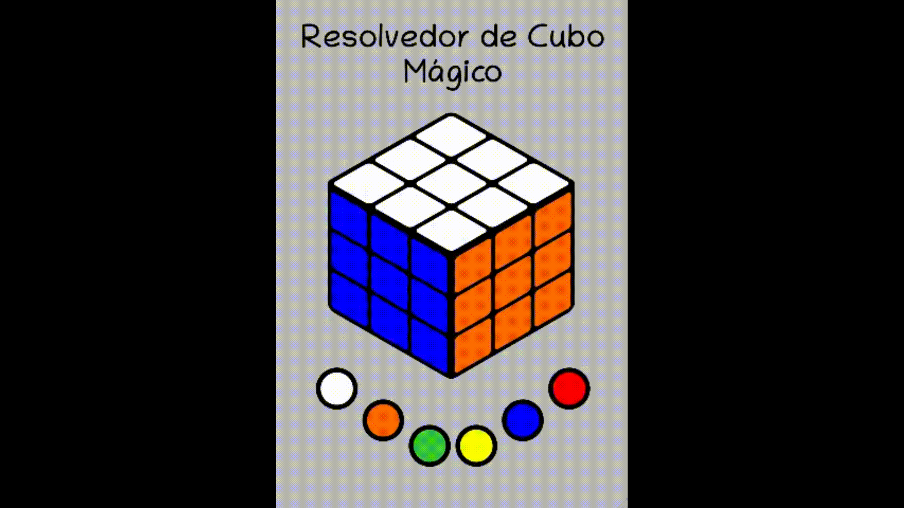

# CuboMagico

## Plano: Criar um resolvedor de cubo mágico com HTML5, CSS3 e Javascript
### A idéia é que a pessoa tenha um cubo mágico que não sabe resolver, ele então pinta esse cubo mágico e ela vai receber um passo-a-passo de como resolver

### Passos:
- [x]  Pintar o cubo mágico
- [ ]  Girar faces
- [ ]  Girar linhas
- [ ]  Girar colunas
- [ ]  Efeitos de transição e de dica
- [ ]  Algoritmo de resolução

